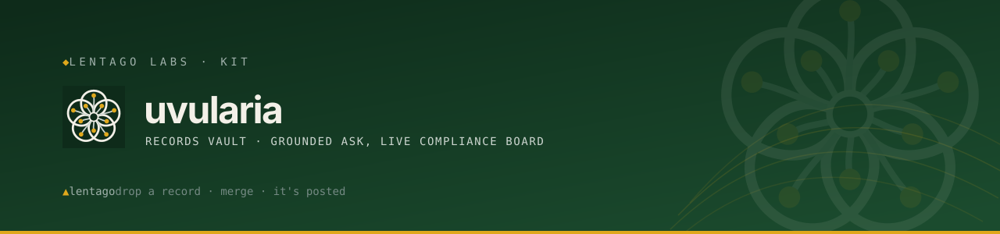

<!-- Lentago Labs brand header — generated by lentago/.github → brand/generate.py.
     Regenerate there; do not hand-edit the banner or badge URLs. -->

  

   

# uvularia

> **Uvularia** (bellwort, a New England native) is the Lentago Labs codename for
> the **records vault**: the bell is the announcement. Born 2026-10-03 under
> [ADR-0009](https://github.com/lentago/.github/blob/main/docs/adr/0009-uvularia-client-owned-records-vault.md).

Your organization's public records — minutes, notices, bylaws, policies, filings,
announcements — kept as a plain Markdown vault in your own GitHub, with the rules
about what must be posted and when kept right next to them. Merge a change and
three things happen without anyone touching a server: the records publish, a
public **"Is it posted?"** board updates, and an Ask box that answers *only from
those records* picks up the new facts. Firing us is a fork.

**Authorship:** the code, prompts, and documentation in this repo are co-written
with [Claude](https://claude.ai) (Anthropic). Chris directs the work and reviews
the output; Claude writes the code and prose. Chris is an infrastructure
operator, not a software engineer. Please don't read this repo as a portfolio of
coding ability.

**Status: Phase 0 complete, pending its first timed dry-run.** The core (schema,
validator, obligation evaluator, bundle format), the records and site templates,
the Issue-form intake, the publish workflow, the public board, and the
demonstration client are all built and tested. What a client needs to adopt it is
written: [`ADOPTION.md`](ADOPTION.md) and a checkpointed [`DRY-RUN.md`](DRY-RUN.md).
No tier is claimed yet: a tier is earned by an operator running the dry-run into a
fresh org and committing a receipt under [`receipts/`](receipts/README.md). When
the first receipt lands, the tier badge appears. The concept and the plan are in
[`docs/concept.md`](docs/concept.md).

## Who this is for

The one tech person at an organization with **posting obligations**: a condo or
HOA board, a nonprofit with a board, a town committee under the Massachusetts
Open Meeting Law, a land trust. You need to add a record or correct one in
minutes, with a small blast radius, and you need to show, live, that what had to
be posted was posted on time.

## The shape

Three repositories in **your** GitHub organization, created from templates here.
Each has its own reviewers, its own required checks, and its own blast radius.

| Repo | What it holds | What a merge does |
|---|---|---|
| `<org>-records` | the Obsidian-compatible vault: one file per record with provenance frontmatter, originals with checksums, `obligations/*.yaml`, an `intake/` folder that is never built, append-only `receipts/` | validates schema, links, privacy tripwires, and obligations; publishes a digest-named corpus bundle, a standing file, a feed, a receipt with a server-side timestamp, and a provenance attestation |
| `<org>-ask-rules` | how the Ask box answers: frozen instructions, allowed subjects, refusal policy, caps, a kill switch, manual incident overrides, golden evals | runs the evals against the currently published corpus; cuts a versioned release the Ask function pins |
| `<org>-site` | presentation only: pages, theme, the Ask widget, the public board | builds from the published bundle, never from the vault; deploys to your GitHub Pages |

A corpus change cannot alter a rule. A rule change cannot alter a fact. A site
change cannot smuggle either.

The Ask box is [mitchella](https://github.com/lentago/mitchella)'s engine with
two added signals: an obligation in breach becomes an incident on its subjects,
and active announcements surface first. The box therefore cannot claim
compliance the board denies.

## Phases

| Phase | Scope | Receipt |
|---|---|---|
| **0 · Vault + board** | vault template, schema, validator, obligation evaluator, Issue-form intake, publish receipts and attestation, the public board on Pages, the demonstration client, `ADOPTION.md`, a timed dry-run | the board live for the demonstration client; a dry-run receipt with elapsed time |
| **1 · Ask box** | rules repo and eval gate, mitchella signal providers, a hardened serverless module, the widget with verified citations | a live answer that cites a record; a live refusal during a manufactured breach |
| **2 · Operator pane** | an Actions-to-Loki push step, the left-to-right pipeline dashboard in your Grafana Cloud free tier, alerts that open Issues | the dashboard in a fresh free-tier stack |
| **3 · Consumers** | the funder-report pipeline and the good-standing reconciliation reading the same vault | one number committed once, cited in three outputs |

Phase 0 has no AI in it and is where the add-quickly, correct-quickly,
low-blast-radius requirement is met. Everything later attaches to a vault that
already works.

## The demonstration client

**Stillwater Brook Watershed Alliance**, a fictional land trust from the
[lupinus stories](https://github.com/lentago/lupinus/blob/main/guide/stories/03-stillwater-brook-watershed-alliance.md).
Its identity lives in one file, `org.yaml`, and its seed records are generated
from templates by a script that reads that file. Renaming or rebranding the
demo is one edit and one re-run, and CI fails if the name appears anywhere
else. A real client starts from an empty vault; the seed is a demonstration and
a lab fixture, not a starting point.

## Layout

| Path | Purpose |
|---|---|
| [`docs/concept.md`](docs/concept.md) | the architecture, the four nouns, the three pipelines, the boundaries |
| [`docs/adr/`](docs/adr/) | product-local decisions; the fleet-level decision is ADR-0009 in `lentago/.github` |
| [`ADOPTION.md`](ADOPTION.md) | how a client adopts Phase 0: what it needs, what it costs, the exits, the traps |
| [`DRY-RUN.md`](DRY-RUN.md) | the checkpointed drill from "Use this template" to a green board, with a receipt |
| [`receipts/`](receipts/README.md) | uvularia's own adoption receipts; the tier picker cites the latest |
| `templates/` | the three repository templates, once Phase 0 lands |
| `core/` | the record and obligation schemas, the validator, the evaluator, the bundle format |
| `demo/` | `org.yaml` and the seed generator for the demonstration client |

---

> 🌱 **Lentago Labs** is a pro-bono operations practice for organizations that
> run on volunteers, donations, and one overworked tech person. Everything here
> is free to take, and we practice what we publish: our own estate runs this
> way, in the open. Start at the [org profile](https://github.com/lentago), and
> read this repo on [DeepWiki](https://deepwiki.com/lentago/uvularia).
